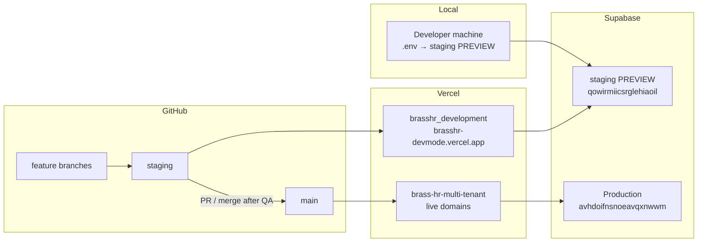

# Development → Production Pipeline

Technical guide for how Brass HR code, environments, and data move from local development through QA into production.

Last updated: 2026-07-16

---

## 1. Overview

Brass HR is a **multi-tenant Next.js app** deployed on **Vercel**, with **Supabase (Postgres + Auth)** as the backend.

We intentionally separate:

| Concern | Dev / QA | Production |
|---|---|---|
| Git branch | `staging` | `main` |
| Vercel project | `brasshr_development` | `brass-hr-multi-tenant` |
| App URL | `https://brasshr-devmode.vercel.app` | live domains (`brasshr.com`, `{tenant}.brasshr.com`, …) |
| Supabase project | Branching **PREVIEW** `qowirmiicsrglehiaoil` (“staging”) | **Production** `avhdoifnsnoeavqxnwwm` |



**Golden rule:** setup / signup / continuation email hosts must match the Supabase project they write to. Never point Preview/devmode at Production Supabase.

---

## 2. Environments (source of truth)

### 2.1 Supabase

| Role | Project ref | Host | Notes |
|---|---|---|---|
| Production | `avhdoifnsnoeavqxnwwm` | `https://avhdoifnsnoeavqxnwwm.supabase.co` | Live tenant data. Treat as sacred. |
| Staging PREVIEW (canonical QA DB) | `qowirmiicsrglehiaoil` | `https://qowirmiicsrglehiaoil.supabase.co` | Supabase Branching preview under Brass HR. Use for local + `brasshr-devmode`. |
| Legacy South (retired for new work) | `mgucromvpnxntwyssltd` | — | Do **not** target for new Preview/QA. |

Do **not** delete or recreate the Supabase Branching `staging` PREVIEW project. Schema work goes into `supabase/migrations/` and is applied carefully to staging first, then production.

### 2.2 Vercel

| Project | ID | Stable alias / domains | Git source for deploys | Supabase target |
|---|---|---|---|---|
| `brasshr_development` | `prj_qUEWmWGKw3f5HdncL3Z5sxUWkTsP` | `https://brasshr-devmode.vercel.app` | Deploy from **`staging`** (script default) | Staging PREVIEW |
| `brass-hr-multi-tenant` | `prj_l7Aqp28rYb9Sy1mmm3pjkN6cltC5` | Production domains (`brasshr.com`, tenant vanities) | Production branch **`main`**; other branches → Preview | Production (Production env); Preview should use staging |

### 2.3 GitHub

Repo: `https://github.com/HuzlyApp/BrassHR_MultiTenant`

| Branch | Purpose |
|---|---|
| `staging` | Integration + QA. Default source for `brasshr-devmode` redeploys. |
| `main` | Production. Only merge after staging QA passes. |
| feature branches | Short-lived work; merge into `staging` first. |

---

## 3. Multi-tenant URL model

Host resolution supports **one** tenant label on the root domain:

- Production vanity: `https://{tenant}.brasshr.com/...`
- Nested hosts like `tenant.staging.brasshr.com` are **not** supported by current middleware.

On Preview / `brasshr-devmode`, use query tenancy:

| Audience | URL pattern |
|---|---|
| Admin / recruiter login | `https://brasshr-devmode.vercel.app/admin?tenant={slug}` |
| Worker / applicant login | `https://brasshr-devmode.vercel.app/worker-signin?tenant={slug}` |
| Applicant onboarding | `https://brasshr-devmode.vercel.app/application/...?tenant={slug}` |
| Owner tenant onboarding | `https://brasshr-devmode.vercel.app/tenant-onboarding/...` |

Platform emails (owner signup continuation, etc.) resolve origin via `resolvePlatformAppOrigin`:

- Prefer request Host for `.vercel.app` / `.vercel.sh` so setup links stay on `brasshr-devmode.vercel.app`.
- Collapse real tenant vanities (`jobs.brasshr.com`) to apex `https://brasshr.com` for platform-owner flows only.

`NEXT_PUBLIC_APP_URL` on `brasshr_development` must be `https://brasshr-devmode.vercel.app` (not production apex).

---

## 4. Day-to-day development flow

### 4.1 Local

1. Point `.env` / `.env.local` at staging PREVIEW (`qowirmiicsrglehiaoil`) — URL, anon, service role.
2. Run `npm run dev`.
3. Use `?tenant={slug}` when exercising tenant-scoped surfaces on localhost.
4. Apply new SQL via migrations against staging before relying on schema in QA.

### 4.2 Feature → staging

1. Create a feature branch from `staging` (preferred) or `main`.
2. Open a PR into **`staging`**.
3. Merge when CI / review pass.
4. Redeploy (or wait for auto-deploy) **`brasshr_development` from `staging`**.

Redeploy helper (defaults to `staging`):

```bash
node scripts/redeploy-brasshr-devmode.mjs --ref=staging
node scripts/poll-vercel-deployment.mjs <deploymentId>
```

Confirm env alignment (no secret values printed):

```bash
node scripts/audit-brasshr-devmode-envs.mjs
node scripts/vercel-set-devmode-staging-envs.mjs --dry-run
# only when correcting misconfigured env:
node scripts/vercel-set-devmode-staging-envs.mjs --apply
```

### 4.3 QA on brasshr-devmode

1. Sign up / exercise flows on `https://brasshr-devmode.vercel.app`.
2. Verify emails use **devmode** hosts, not `brasshr.com`.
3. Verify app reads/writes staging PREVIEW data only.
4. For a tenant like `nicee`:
   - Admin: `/admin?tenant=nicee`
   - Worker: `/worker-signin?tenant=nicee`

Old emails minted against production hosts remain invalid for staging tokens — re-send after host/env fixes.

---

## 5. Promotion to production

Recommended path (never skip QA):

```text
feature branch → merge to staging → QA on brasshr-devmode
        → PR staging → main → production deploy on brass-hr-multi-tenant
        → apply/verify production migrations
```

### 5.1 Code

1. Open PR: `staging` → `main`.
2. Ensure QA checklist passed on `brasshr-devmode`.
3. Merge to `main`.
4. Confirm Vercel Production deployment for `brass-hr-multi-tenant` is READY.

### 5.2 Database

1. Migrations live in `supabase/migrations/`.
2. Apply / verify on **staging PREVIEW** first.
3. Promote the same migrations to **Production** only after QA.
4. Prefer migration files over ad-hoc dashboard SQL so environments stay reproducible.
5. Never run destructive ops against Production without an explicit rollback plan.

### 5.3 Environment variables

Production Vercel env must stay on Production Supabase keys.

Devmode Vercel env must stay on staging PREVIEW keys + `NEXT_PUBLIC_APP_URL=https://brasshr-devmode.vercel.app`.

Do not copy Production `SUPABASE_SERVICE_ROLE_KEY` into Preview/devmode.

---

## 6. Operational scripts

| Script | Purpose |
|---|---|
| `scripts/redeploy-brasshr-devmode.mjs` | Trigger Vercel deploy of `brasshr_development` (default git ref `staging`) |
| `scripts/poll-vercel-deployment.mjs` | Poll a deployment until READY / ERROR |
| `scripts/vercel-set-devmode-staging-envs.mjs` | Align `brasshr_development` env to staging PREVIEW |
| `scripts/audit-brasshr-devmode-envs.mjs` | Classify which Supabase ref env vars point at (no secret dump) |
| `scripts/check-staging-domains.mjs` | Inspect staging-related Vercel domain state |

Require `VERCEL_TOKEN` and `VERCEL_TEAM_ID` in local `.env`.

---

## 7. Safety rules

1. **Never** connect Preview / `brasshr-devmode` to Production Supabase.
2. **Never** delete the Supabase Branching staging PREVIEW project (`qowirmiicsrglehiaoil`).
3. Do not attach live tenant vanity domains to the staging/devmode app.
4. Prefer `?tenant=` on Preview/devmode; do not expect `tenant.staging.brasshr.com` to work.
5. Owner signup continuation links must open on the same host + DB that created the token.
6. Custom onboarding workflows are tenant-owned; default-workflow migrations must fingerprint defaults and not blindly overwrite customized flows.
7. Production releases go through `staging` QA → `main`; hotfixes still need a documented exception and follow-up merge.

---

## 8. Release checklist

### Before merging to `staging`

- [ ] Feature branch builds locally
- [ ] Migrations added if schema changed
- [ ] Tests updated for changed defaults / routes

### After merge to `staging`

- [ ] `brasshr_development` deploy is READY from commit on `staging`
- [ ] Env audit shows staging PREVIEW refs + correct `NEXT_PUBLIC_APP_URL`
- [ ] Smoke: signup / admin login / worker login with `?tenant=`
- [ ] Email links use `brasshr-devmode.vercel.app` when testing on that host

### Before / after merging to `main`

- [ ] Staging QA signed off
- [ ] PR `staging` → `main` reviewed
- [ ] Production Vercel deploy READY
- [ ] Production migrations applied / verified
- [ ] Smoke on a non-destructive production path
- [ ] Confirm no staging secrets landed in Production env (and vice versa)

---

## 9. Common failure modes

| Symptom | Likely cause | Fix |
|---|---|---|
| Setup email points at `brasshr.com` from devmode signup | Host collapsed to apex / wrong `NEXT_PUBLIC_APP_URL` / deploy from `main` | Ensure Host-preserving origin resolution is deployed; set APP_URL to devmode; redeploy from `staging` |
| `User not allowed` on signup | Missing/invalid `service_role` on that Vercel project | Re-apply staging service role via env script + redeploy |
| Token invalid on continue link | Token minted in staging DB but redeemed on production host (or the reverse) | Use matching host + DB; re-send email after fix |
| Tenant not found on Preview | Using vanity subdomain pattern unsupported on Preview | Use `?tenant=slug` |
| QA sees production data | Env pointed at `avhdoif…` | Audit env refs; never share Production service role with Preview |

---

## 10. Related code

- Origin / email hosts: `lib/resolve-app-origin.ts`
- Tenant query helpers: `lib/tenant/with-tenant.ts`, middleware tenant slug headers
- Default applicant workflow seed: `lib/onboarding/default-onboarding-steps.ts`, `supabase/migrations/*seed_default_tenant_onboarding*`
- Devmode ops scripts: `scripts/redeploy-brasshr-devmode.mjs`, `scripts/vercel-set-devmode-staging-envs.mjs`

---

## 11. Current target end-state (summary)

```text
Local .env  ───────────────►  staging PREVIEW DB
Git staging ──deploy──►  brasshr-devmode  ──►  staging PREVIEW DB
Git main    ──deploy──►  production app   ──►  Production DB
```

Promote code with git. Promote schema with migrations. Keep hosts, env vars, and databases aligned per environment.
